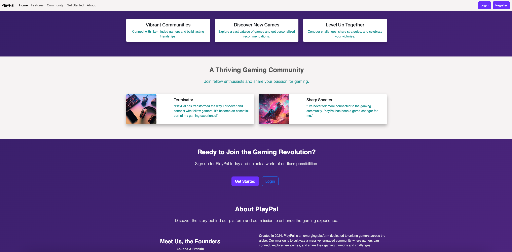
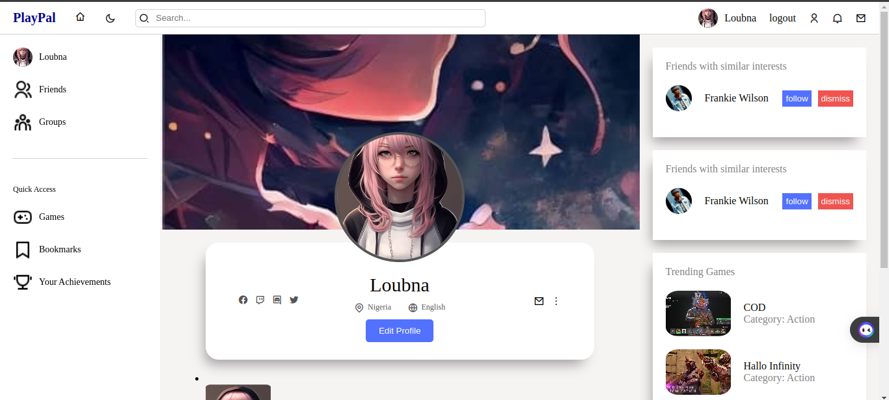
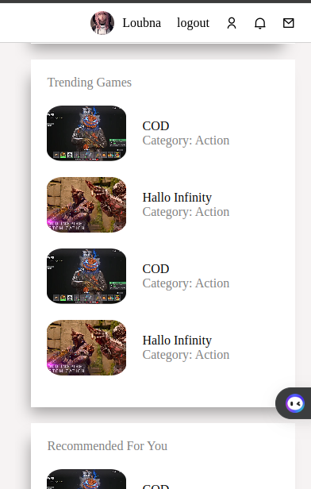
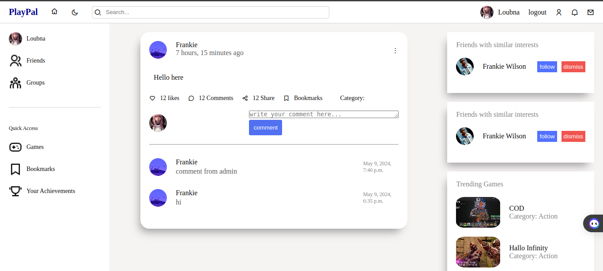

# PlayPal: Connect, Play, Share, and Level Up Together

PlayPal is a social gaming platform designed to revolutionize your gaming experience. Whether you're a seasoned gamer or just starting, PlayPal provides a vibrant community where you can connect with fellow gamers, discover new games, and level up together.

## Usages

1. **Create an Account:**
   Sign up for a PlayPal account using your email address to access all features.

2. **Discover Games:**
   Explore a vast catalog of games, discover new titles, and find recommendations based on your preferences.

3. **Connect with Gamers:**
   Join communities, participate in discussions, and connect with gamers who share your interests.

4. **Level Up Together:**
   Collaborate with other players, share tips and strategies, and conquer challenges together.

## Features of PlayPal

- **User-Friendly Interface:**
  Navigate through PlayPal's intuitive interface to explore its features seamlessly.

- **Community Building:**
  Connect with like-minded gamers, join communities, and engage in discussions about your favorite games.

- **Game Discovery:**
  Discover new games tailored to your preferences through personalized recommendations and user reviews.

- **Collaborative Gaming:**
  Team up with other players, form alliances, and embark on epic gaming adventures together.

## License

PlayPal is licensed under the MIT License.

## Want to Contribute?

Interested in contributing to PlayPal? We welcome pull requests and issue reports. Your contributions help make our platform better for everyone.

## Technologies Used

### Languages and Frameworks:
- JavaScript: Utilizing React.js for frontend development.
- HTML/CSS: Building the user interface and styling the application.

### Database:
- MongoDB: Utilizing MongoDB as the database management system.

### Libraries and Tools:
- Redux: Managing application state and data flow in the frontend.
- Bootstrap: Utilizing Bootstrap for responsive web development.

### Development Environment:
- Git: Version control for collaborative development.
- Docker: Containerization for easy deployment and scalability.

### Project Management and Collaboration:
- Trello: Managing tasks and project timeline.
- Discord: Communication and collaboration among team members.

### Documentation and Learning Resources:
- React.js Official Documentation: Detailed guides and references for frontend development.

## Challenges and Considerations

### Technical Risks:
- **Third-Party API Reliability:**
  Dependence on external APIs for game data and services may pose a risk of disruption or downtime.
  
- **Performance Optimization:**
  Ensuring optimal performance and responsiveness across different devices and platforms.

### Non-Technical Risks:
- **Community Engagement:**
  Fostering a positive and inclusive community culture while mitigating potential conflicts or negative interactions.
  
- **User Experience and Expectations:**
  Aligning user expectations with platform features and functionality to enhance user satisfaction and retention.

## Infrastructure

### Branching Strategy:
- **Main Branch:**
  Stable production-ready version of the code.
- **Feature Branches:**
  Development branches for implementing new features or addressing specific issues.

### Merging Process:
- **Code Reviews:**
  Thorough review of changes before merging into the main branch.
- **Pull Requests:**
  Submission of pull requests for discussion and validation of code changes.

### Deployment Strategy:
- **Environment Segmentation:**
  Development, staging, and production environments for testing and deployment.
- **App Population:**
  User-generated content, game database, and trending/recommended games.

## Existing Solutions

### Similar Platforms:
- Discord: Offers social networking features and community building for gamers.
- Steam: Provides digital distribution and social features for gamers.
- Reddit: Hosts gaming-related communities and discussions.

## Support

For any questions, issues, or feedback, please contact our team at [loubnamerzak4@gmail.com][frankie.1@gmail.com].

---

Join us on PlayPal and unlock a world of gaming possibilities. Connect, play, share, and level up together!
